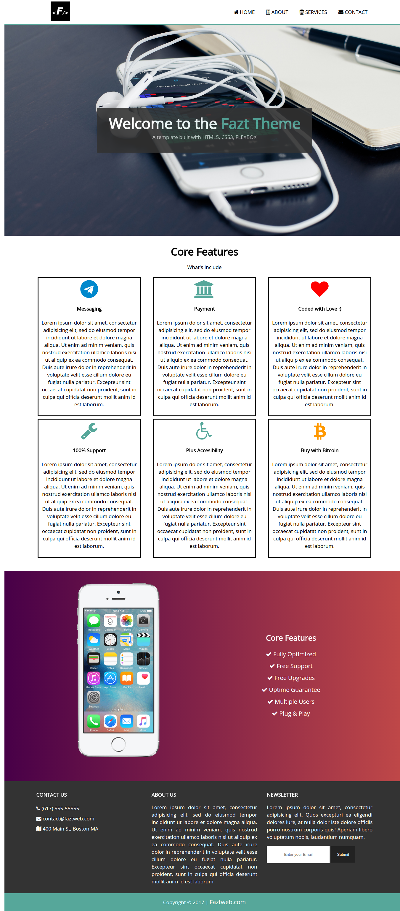

## FlexboxGrid and Node.js
This project is a static website basic example for node.js(Express.js), and flexbox,
using the FlexboxGrid framework and sass, is just to practice these thecnologies.

## ScreenShoot

## Requiriments to Understand this Project
- FrontEnd Basics: HTML5 + CSS3
- Sass preprocessor CSS3
- Node.js

## To execute the Project
- first, dowload or clone the project: `git clone `
- install dependencies first: `yarn` or `npm install`
- to start the server: `yarn start` or `npm start`

## Structure of the Project
this structure is generated with the tree tool, `tree -I 'node_modules'`:

## Tools
- Node.js
- Git
- Atom.io, just my favorite code Editor

## Core Dependencies
- Express.js
- [Ejs](), for this little project I choose ejs
  because is very similar, but you can change it for other template engines, as
  pug, handlebars, jade, an so on.
- sass, throught node-sass, package and node-sass-middleware
- FlexboxGrid

## Web Tools
- [UiGradients](https://uigradients.com/), in the past we had to have a image as
  gradiendt, but now we can use CSS3, and this page is a tool that allows you to
  choose your color, and it will generate the CSS Code.
